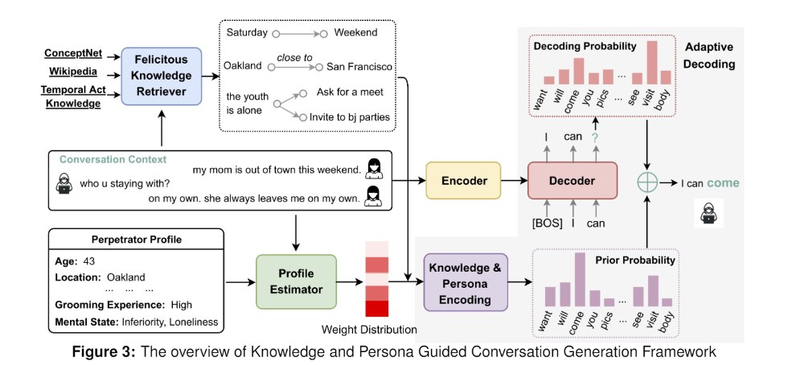

# SaTC: Improving Adolescents’ Risk-Coping Skills Against Cybergrooming Using Conversational Agents

 

### Dataset
<b><i>Cleaned</i> Format 1</b>(226 samples): span class='blueBold'>[username] /span> (08/22/06 12:15:23 AM): [message] br/>

<b><i>Cleaned</i>Format 2</b>(9 sample): 8/1/2006 7:22:23 PM: {[username]}[message] br />

- [ ] Clean PJ Dataset (37%: 235/624)

### Thrust AI

#### Research Questions
1. (SE-I) Given the pre-specified profile of each role, how can the chatbot be enforced to generate informative, logically consistent, and “human-like” conversations by leveraging the profiles of each role and various knowledge resources?
2. How can vulnerability- and resilience-aware reward in deep reinforcement learning help simulating perpetrator and user agents achieve their respective objectives respectively in the conversation?
3. How does the accurate prediction of a human user’s action (i.e., utterance) affect the perpetrator agent’s performance in maximizing the chances to achieve its objective?

#### SE-I: Two simulating agents
##### To Do:
- [x] Train Llama2 (1.1b) to be groomer
- [x] Train Llama2 (1.1b) to be victim
- [x] Develop a way to utilize a user profile
- [ ] Leverage RL to try and train either model

#### SE-II: Simulating a perpetrator with a real teen user
##### To Do:
- [ ] Train a model to *Fuzz* explicit words or to avoid using the words in general
- [ ] Train a model that can give advice feedback about what to do or what not to do in the conversation (i.e., it is not advised to give out your address online, good job not agreeing to meet in person)
- [ ] Setup Backend to host models for inference
- [ ] Develop simple frontend for demo

### Thrust HCI: Development of Appropriate and Safe Experiential Intervention Program